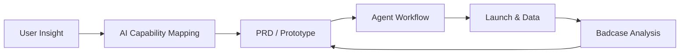

  

<h1 align="center">AIPM AmoryZ｜AI 产品经理</h1>

  <b>把用户场景、AI 能力与工程落地连接起来，做可用、好用、可增长的 AI 产品。</b> 
  AI Product Manager · Agent Builder · Robotics Product Thinking

  
  
  

---

## 🚀 关于我

我是一名面向 AI Native 产品的产品经理，关注 **LLM Agent、多智能体协作、AI 工具、机器人交互与数据驱动迭代**。

- 💼 **快手 AI 产品经理实习**：参与 AI 产品需求分析、体验打磨与跨团队协作。
- 🤖 **AI 机器人产品经理实习**：关注机器人使用场景、交互流程与智能能力落地。
- 🧠 **产品方法**：从用户洞察 → 需求拆解 → PRD/MVP → 原型验证 → 数据反馈 → 版本迭代。
- 🛠️ **技术理解**：能用 Python / FastAPI / React / TypeScript 与工程团队高效沟通，也能快速做原型验证。

> 我相信优秀的 AI 产品经理，不只是“写需求”，而是能把模型能力转译成真实用户价值，并推动它稳定落地。

---

## 🧩 我的 AI 产品能力地图

| 能力模块 | 我能做什么 |
| --- | --- |
| 🧭 产品策略 | 定义目标用户、核心场景、差异化定位与 MVP 边界 |
| 📝 需求与 PRD | 输出用户旅程、功能优先级、验收标准、迭代路线图 |
| 🤖 Agent 产品设计 | 设计 Agent 角色、任务流、工具调用、记忆/知识库与协作机制 |
| 🦾 机器人产品 | 梳理机器人场景、任务闭环、人机交互和异常兜底体验 |
| 📊 数据迭代 | 设计指标、收集反馈、定位 badcase，并转化为产品/模型优化方向 |
| 🔧 原型落地 | 用 AI 编程工具与全栈框架快速验证想法，降低沟通成本 |

---

## ⭐ Featured Projects

<table>
  <tr>
    <td width="50%" valign="top">
      <h3><a href="https://github.com/Amory-ZDF/AgentHub">AgentHub</a></h3>
      
<b>多 Agent 协作平台</b>：以 Mission 为单位沉淀 Agent Team、Skill 与知识库，让复杂任务可以被复用、迭代和协作完成。

      <ul>
        <li>7 级 Orchestrator 路由与任务拆解思路</li>
        <li>对话式 Agent 创建 / 修改</li>
        <li>多模型接入与 Skill 工具集设计</li>
      </ul>
    </td>
    <td width="50%" valign="top">
      <h3><a href="https://github.com/Amory-ZDF/lvtu-AI">旅图 Lvtu-AI</a></h3>
      
<b>AI 旅行规划平台</b>：覆盖灵感发现、目的地推荐、行程规划、机位穿搭推荐、协同编辑与社区分享。

      <ul>
        <li>AI 推荐与行程规划产品闭环</li>
        <li>React + FastAPI 的完整产品原型</li>
        <li>实时协同、社区与增长场景设计</li>
      </ul>
    </td>
  </tr>
</table>

  
  

---

## 🧠 我正在构建的方向

- **AI Agents & Tools**：让 Agent 从“会聊天”走向“能持续完成任务”。
- **AI + Robotics**：把智能能力放进真实空间和真实流程里。
- **Product-Led AI**：用清晰场景、约束、指标和反馈闭环，把 AI 做成产品。

---

## 🛠️ Stack & Tools

  
  
  
  
  

---

## 📈 GitHub Snapshot

  
  

---

## 🤝 联系我

- 💬 WeChat：`zdf305921`
- 📍 GitHub：[@Amory-ZDF](https://github.com/Amory-ZDF)

如果你也在做 **AI 产品、Agent、AI 工具或机器人体验**，欢迎交流。  
If you are building AI products, agents, tools, or robot experiences, let's connect.

  <b>⭐ If you find my projects helpful, please give them a star!</b>

